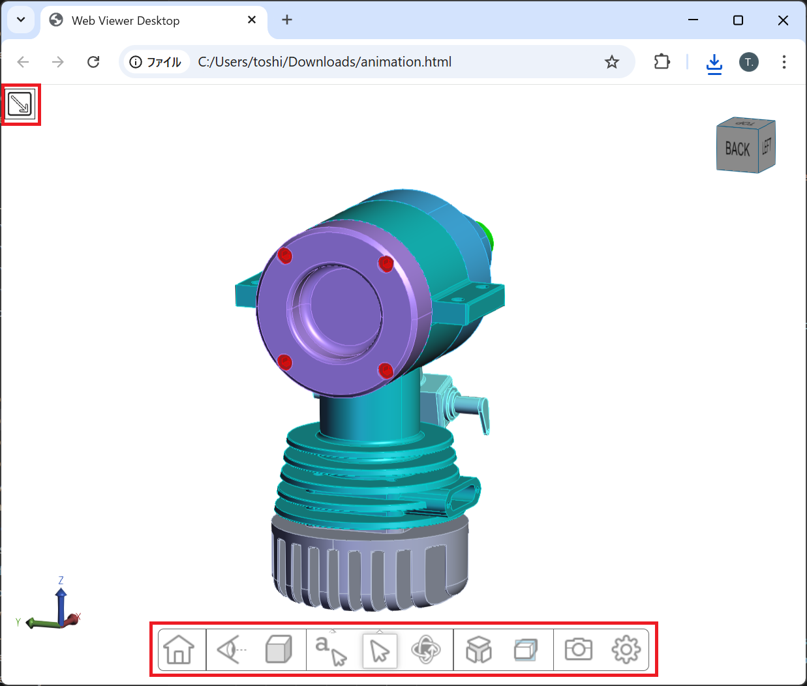
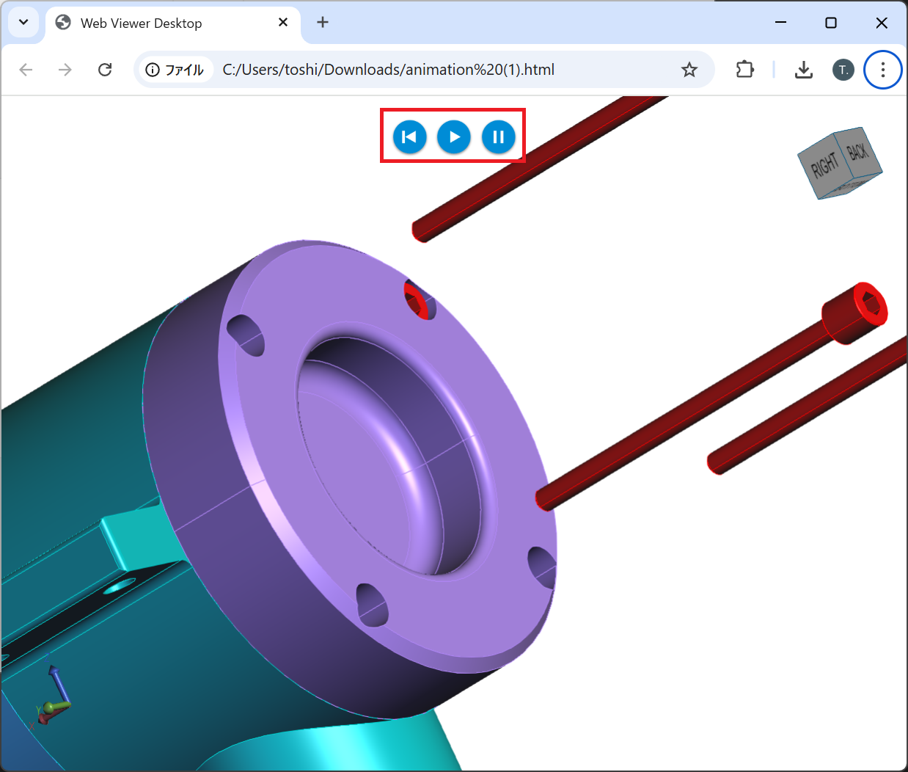
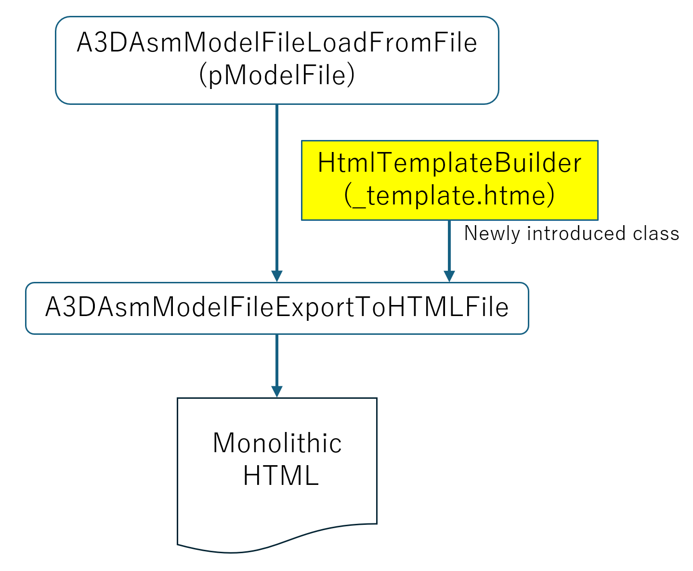

# Enhanced Export3DToHtml Sample for HOOPS Publish

## Overview

This sample extends the standard `Export3DToHtml` example included in the HOOPS Publish SDK. The original sample functions as a basic template for a 3D Web viewer, suitable for web visualization. This enhanced version adds greater flexibility and extensibility to serve as a richer template for creating standalone, monolithic HTML viewers.  

| Original                                                | Enhanced                                                |
| ------------------------------------------------------- | ------------------------------------------------------- |
|  |  |

### Key Enhancements

- Provides a customizable template that allows:
  - **Toggle display** of UI components such as **Model Tree**, **Toolbar**, **Axis Triad**, and **Navigation Cube**
  - **Injection of user-defined UI elements**, **JavaScript**, and **CSS styles** into the HTML template
  - Export of a **monolithic HTML** file that contains all 3D data, viewer logic, custom UI, and styling in a single distributable file

### Flowchart
<p align="left">
    
</p>

#### HtmlTemplateBuilder
A newly added custom class that that generates a customized Monolithic HTML template by combining a set of pre-divided template fragments.  
These fragments—separated by function and purpose—are selectively assembled at runtime based on the provided option flags.  
During this build process, it is also possible to inject custom scripts, callback logic, and additional UI elements into the template.

## Fragments-Separated Template Files and Option Flags

### Fragments-separated Template Files
These files are functional fragments of the original `export3dtohtml_template.html`, split by purpose (scripts, styles, UI).    
They are stored together with custom script and UI files in the `template/` folder for dynamic assembly during export.

| No. | File Name                          | Description                                         | Option Bit(s) |
|-----|-----------------------------------|-----------------------------------------------------|---------------|
| 01  | `01_head.html`                    | HTML `<head>` opening section                      | Always        |
| 02  | `02_script_jquery.html`           | jQuery library                                     | Always        |
| 03  | `03_script_UI_interaction.html`   | Includes key handling, scrolling libraries         | Always        |
| 04  | `04_script_HWV.html`              | HOOPS Web Viewer API                               | Always        |
| 05  | `05_script_jquery_minicolors.html`| jQuery minicolors plugin                           | Always        |
| 06  | `06_script_HWV_server.html`       | Server-related HWV scripts                         | Always        |
| 07  | `07_script_HWV_sample.html`       | Sample viewer-specific scripts                     | Always        |
| 08  | `08_style_modelTree.html`         | CSS styles for the model tree                      | 1             |
| 09  | `09_style_toolBar.html`           | CSS styles for the toolbar                         | 1, 2          |
| 10  | `10_style_common.html`            | Common viewer layout and style                     | Always        |
| 11  | `11_style_jquery.html`            | Styles for jQuery UI components                    | Always        |
| 12  | `12_style_viewer_dialogs.html`    | Styles for viewer dialogs                          | 1, 2          |
| 13  | `13_style_jquery_minicolors.html` | Styles for jQuery minicolors UI components         | Always        |
| 14  | `14_style_relationships.html`     | CSS for relationships                              | Always        |
| 15  | `15_custom_style_script.html`     | Custom styles and scripts to inject                | 5             |
| 16  | `16_script_start_viewer.html`     | Viewer start + SCS embed script                    | Always        |
| 17  | `17_custom_script_before_start_viewer.js` | Pre-start hook script                      | 6             |
| 18  | `18_body_toolbar.html`            | HTML for the toolbar UI                            | 1, 2          |
| 19  | `19_body_viewerSettings.html`     | HTML for the viewer settings panel                 | 1, 2          |
| 20  | `20_body_snapshot_dialog.html`    | HTML for the snapshot dialog                       | 1             |
| 21  | `21_custom_body.html`             | Custom UI elements for `<body>`                    | 7             |

> **Note:** The contents of `17_custom_script_before_start_viewer.js` are inserted into the line marked `//BEFORE_START_VIEWER` inside `16_script_start_viewer.html`.  
> This allows for dynamic, runtime logic such as user-defined callbacks or custom operator registrations.  
> In contrast, `15_custom_style_script.html` is intended for static custom styles or class definitions to be embedded into the HTML template.

### Option Flags

The option is specified as a 7-character bit flag (e.g., 0011111) and passed as the third argument in the command line.  
Each bit enables or disables a specific UI feature or customization. The flags are read from **left to right (bit 1 to bit 7)**:  

| Bit | Description | Value `1` = Enabled | Value `0` = Disabled |
|-----|-------------|----------------------|-----------------------|
| 1   | **Standard UI** (model tree, toolbar, axis triad, nav cube) | Show all standard UI | Disable → Use bits 2–4 to control individually |
| 2   | Toolbar (only used when bit 1 = 0) | Show toolbar | Hide toolbar |
| 3   | Axis Triad (only used when bit 1 = 0) | Show axis triad | Hide axis triad |
| 4   | Navigation Cube (only used when bit 1 = 0) | Show nav cube | Hide nav cube |
| 5   | Custom styles/scripts from `15_custom_style_script.html` | Inject custom CSS/classes | Do not inject |
| 6   | Pre-start custom JS from `17_custom_script_before_start_viewer.js` | Run before viewer starts | Do not run |
| 7   | Custom body UI from `21_custom_body.html` | Add UI elements inside `<body>` | Do not add |

### Examples

- `1000000`    
  Enable **Standard UI** (model tree, toolbar, triad, nav cube), no custom scripts or UI.  
  The generated template will be equivalent to the default `export3dtohtml_template.html` provided in the SDK.  

- `0111000`    
  Disable Standard UI, but enable **Toolbar**, **Triad**, and **Nav Cube** individually.  

- `0001111`    
  Disable Standard UI, hide all default UI, but **enable all custom extensions** (style, script before viewer, and custom body UI).  

> **Note:** The `template/` folder must include the corresponding files (`15_*.html`, `17_*.js`, `21_*.html`) for the custom bits (5–7) to take effect.  

## Use Case Example: Exporting HOOPS Animation Creator Results

A key use case for this enhanced sample is the ability to export results created with **Animation Creator**. The sample can capture animation sequences and embed them directly into the monolithic HTML, enabling:
- Visualization of animated technical procedures
- Sharing of simulation scenarios
- Offline review of dynamic 3D content

## Dependencies
### SDKs in Use (Version)
* HOOPS Communicator: 2025.5.0
* HOOPS Exchange_Publish: 2025.5.0

### Tested Server Platforms
* Windows 11
* Ubuntu Server 24.04 LTS (AWE EC2 instance)

## Setup
### Demo folders
The project is organized as follows:
```plaintext
Export3DToHtml_temp_build/               # Root folder
├── bin/                        
│   └── Export3DToHtml                   # Monolithic HTML converter executable
├── Export3DToHtml/                      # Project and source code
│   ├── Export3DToHtml.cpp               # Main source code
│   └── HtmlTemplateBuilder.cpp & .h     # HTML template builder source files
├── template/                           
│   ├── _htmltemplate.html               # Template dynamically generated by HtmlTemplateBuilder
│   ├── 01_head.html
│   ├── ...
│   └── 21_custom_body.html             
├── _VS2019.bat                         # Solution launcher batch file (for Windows)
├── Export3DToHtml.sln                  # Visual Studio solution file (for Windows)
└── Makefile                            # Build script for Linux
```
### Build Instructions
#### Windows
1. Edit `_VS2019.bat` according to your environment   
2. Double-click `_VS2019.bat` to open the Visual Studio solution   
2. Build the `Export3DToHtml` project   
3. The output executable will be located in `bin/`   

#### Linux
1. Edit `Makefile` according to your environment   
2. Open a terminal in the root directory (`Export3DToHtml_temp_build/`)   
3. Run `make` to build the project   
4. The resulting binary will appear in `bin/`   

> **Note:** Before building, ensure that the HOOPS Publish SDK include and library paths are correctly configured for your development environment.

### Run Instructions

After building the project, follow these steps to run the `Export3DToHtml` converter:  
1. Copy Required Runtime Files  
   Copy the necessary runtime files from the HOOPS Publish SDK `bin` folder into the executable directory.  
     Copy all files from `<HOOPS_PUBLISH_SDK>/bin/win64_v142/` or `linux64/` to`Export3DToHtml_temp_build/bin/`  
2. Open a Terminal and navigate to the executable directory:  
    `cd Export3DToHtml_temp_build/bin/`  
3. Set the library path environment variable (Linux):
    ```bash
    `export LD_LIBRARY_PATH=/path/to/Export3DToHtml_temp_build/bin`
    ```
3. Run the Executable with Arguments  
    `./Export3DToHtml [INPUT] [HTML_TEMPLATE_DIR] [OPTIONS] [OUTPUT] [LOG_FILE]`  
    i.e.  
    `./Export3DToHtml sample.prc ../template/ 0011111 output.html log.txt`
4. Verify Output  
   - The resulting monolithic HTML file will be created at the `[OUTPUT]` path  
   - Check `[LOG_FILE]` for conversion status or error messages  

#### Argument Descriptions

- `[INPUT]`: The 3D CAD file to embed in the HTML (e.g., `.prc`, `.stp`, `.jt`)  
- `[HTML_TEMPLATE_DIR]`: Path to the templates directory (usually `../template/`)  
- `[OPTIONS]`: Optional flags (e.g., toolbar/UI toggles)  
- `[OUTPUT]`: Path to save the resulting monolithic HTML file  
- `[LOG_FILE]`: Path to save the log file for conversion details  

